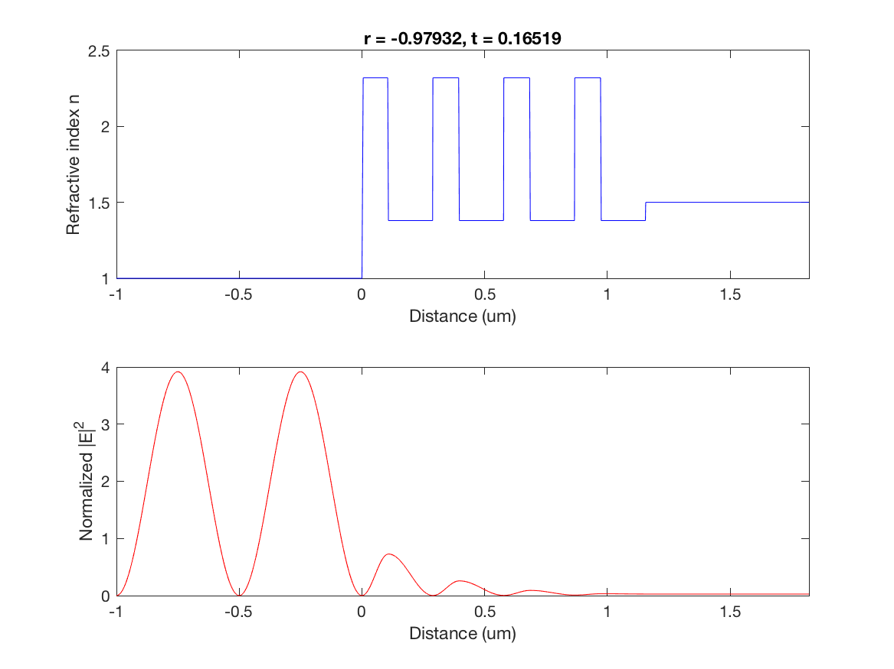
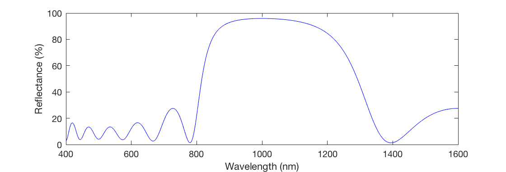

# optical-field-transfer-matrix
Transfer-matrix method to calculate reflectance, transmittance and the electric field strength across an optical multilayer.
For a thorough derivation of the method see, for instance: C. C. Katsidis, D. I. Siapkas. Applied Optics, 41, 3978 (2002), https://doi.org/10.1364/AO.41.003978.

### Installation
```
$ git clone https://github.com/andibarg/optical-field-transfer-matrix.git
$ cd optical-field-transfer-matrix
```

### Usage
The function 'tmm.m' takes as inputs the wavelength, layer refractive indices <em>n<sub>i</sub></em> and layer widths <em>w<sub>i</sub></em>. It returns the amplitude reflection coefficient <em>r</em> and the transmission coefficient <em>t</em>, as well as arrays to plot the electric field strength <em>E</em> vs position <em>x</em>.

As an example, the script 'example_dbr.m' calculates the field in a lossless dielectric mirror on a glass substrate, where the coating materials are magnesium fluoride (<em>n</em><sub>MgF2</sub> = 1.38) and zinc sulfide (<em>n</em><sub>ZnS</sub> = 2.32). The following figure shows the normalized electric field strength across 8 alternating layers, each with a thickness of <em>n<sub>i</sub> w<sub>i</sub></em> = <em>λ</em>/4, where <em>λ</em> = 1 μm is the wavelength.



For the same mirror the following figure shows the reflectance as a function of wavelengths.


